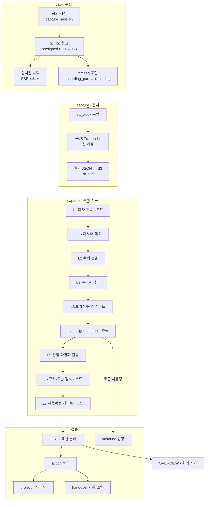
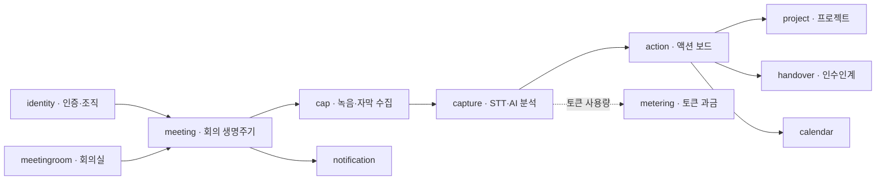
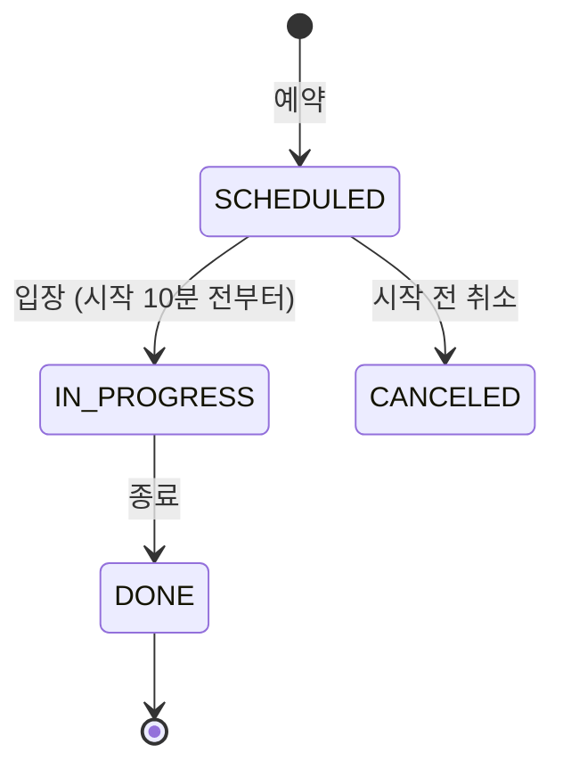
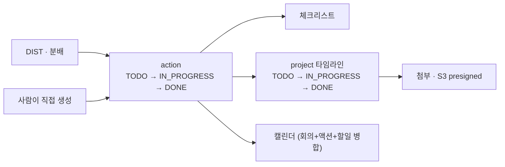
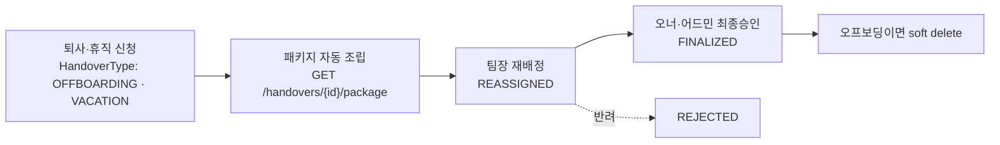
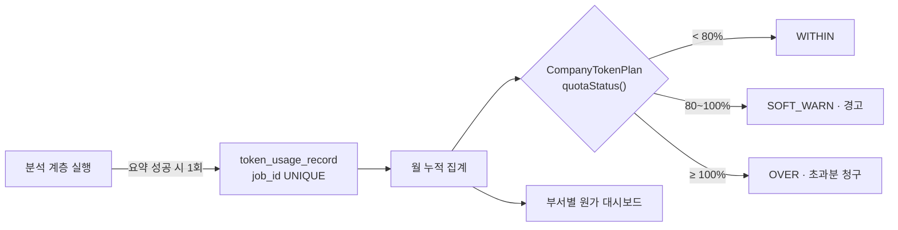
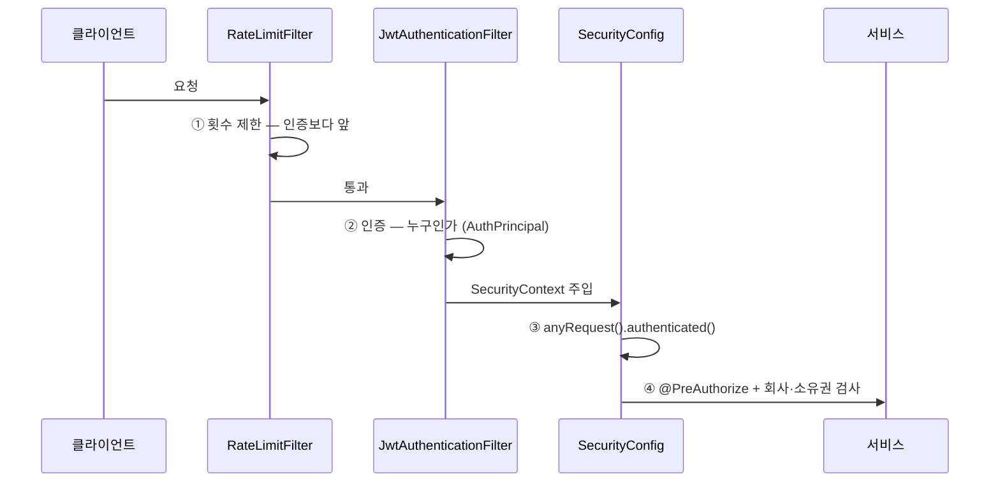
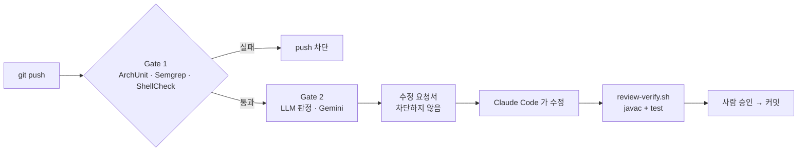

<div align="center">


# Z · Groupware Backend

[](https://openjdk.org/projects/jdk/17/)
[](https://spring.io/projects/spring-boot)
[](https://www.mysql.com/)
[](https://redis.io/)
[](https://flywaydb.org/)
[](https://aws.amazon.com/)
[](https://www.docker.com/)

</div>

---

## 목차

- [무엇을 만들었나](#무엇을-만들었나)
- [핵심 파이프라인](#핵심-파이프라인)
- [기술 스택](#기술-스택)
- [아키텍처](#아키텍처)
- [도메인 지도](#도메인-지도)
- [회의 — 예약부터 종료까지](#회의--예약부터-종료까지)
- [액션과 프로젝트 — 뽑아낸 할 일이 굴러가는 곳](#액션과-프로젝트--뽑아낸-할-일이-굴러가는-곳)
- [인수인계 — 퇴사 버튼 하나로 조립된다](#인수인계--퇴사-버튼-하나로-조립된다)
- [미터링 — seat 이 아니라 토큰으로 과금한다](#미터링--seat-이-아니라-토큰으로-과금한다)
- [API 개요](#api-개요)
- [데이터베이스](#데이터베이스)
- [보안](#보안)
- [AI 코드 리뷰 루프](#ai-코드-리뷰-루프)
- [CI/CD](#cicd)
- [로컬에서 실행하기](#로컬에서-실행하기)
- [테스트](#테스트)
- [문서 지도](#문서-지도)
- [개발 규약](#개발-규약)

---

## 무엇을 만들었나

회의에서 오간 말은 대부분 회의실을 나가는 순간 사라진다. 누가 무엇을 언제까지 하기로 했는지는
각자의 기억과 메모에 흩어지고, 담당자가 퇴사하면 그 맥락은 통째로 증발한다.

**Z** 는 그 흐름을 하나의 파이프라인으로 잇는 AI 네이티브 그룹웨어다.

| 단계 | 하는 일 |
|---|---|
| **캡처** | 대면·비대면 회의의 음성을 청크 단위로 수집하고 실시간 자막을 흘려보낸다 |
| **분석** | 음성을 텍스트로 바꾸고, 9단계 분석 계층이 주제·결정·담당자를 뽑아낸다 |
| **분배** | 추출된 `(담당자, 할 일, 기한)` 튜플을 실제 액션 카드로 사람 보드에 꽂는다 |
| **추적** | 액션이 프로젝트·팀 대시보드에서 진행 상태로 굴러간다 |
| **인수인계** | 퇴사·휴직 버튼 한 번에, 출처 회의까지 붙은 인수인계서가 자동 조립된다 |
| **과금** | seat 이 아니라 **실제 AI 토큰 사용량** 기준으로 원가를 계량한다 |

### 규모

| | |
|---|---|
| 프로덕션 Java 파일 | **1,320개** (83,825 라인) |
| 테스트 파일 | **345개** (63,776 라인) |
| REST 엔드포인트 | **143개** (컨트롤러 47개) |
| 도메인 | **15개** |
| Flyway 마이그레이션 | **120개** |
| 에러 코드 | **182개** (도메인 접두어 15종) |
| 커밋 · 기여자 | **1,146 커밋 · 6명** (`develop` 기준) |

---

## 핵심 파이프라인

회의 하나가 액션 카드가 되기까지의 전체 경로다.



L1·L6·L7 은 LLM 을 부르지 않는 **코드 계층**이다. 나머지 6개가 AI EC2(Python 서버)를 호출한다.

### 이 파이프라인의 설계 결정 몇 가지

- **`analysis_layer` 에 `UNIQUE(meeting_id, layer)`** — 큐가 at-least-once 라 같은 회의가 두 번
  들어오는 일은 언젠가 반드시 일어난다. 그때 만들어지는 것이 사람 보드에 꽂히는 액션이므로,
  중복 분배를 DB 제약으로 막는다.
- **`DIST` 와 `OVERVIEW` 는 계층 번호를 받지 않는다** — 모델을 부르지 않는 단계라 `L1~L7` 과
  같은 줄에 세우면 AI 계층이 하나 더 있는 것처럼 읽힌다.
- **`OVERVIEW` 는 완료 판정에서 빠진다** — 개요 생성 실패가 회의 전체를 「미완」으로 만들면
  재실행이 **모든 계층의 토큰을 다시 태운다**. 표시용 문장 하나 때문에.
- **L7 자동확정 게이트는 모델이 말한 확신도를 쓰지 않는다** — 코드가 4개 조건을 직접 검사한다.

---

## 기술 스택

| 영역 | 사용 기술 |
|---|---|
| **런타임** | Java 17 (Temurin) · Spring Boot 4.1.0 · Gradle |
| **웹** | Spring MVC · springdoc-openapi 3.0.3 (Swagger UI) · SSE |
| **영속성** | Spring Data JPA · MySQL 8 · Flyway · HikariCP |
| **캐시·세션** | Redis 8.8 (리프레시 토큰 스토어 · 레이트 리밋 카운터) |
| **인증** | Spring Security · jjwt 0.12.6 (HS256) · BCrypt |
| **AWS** | S3 (녹음·첨부·STT I/O) · Transcribe (STT) · EC2 · SSM Parameter Store |
| **AI** | 사내 Python AI 서버 (RestClient + `X-Internal-Token`) · Anthropic Java SDK (리뷰 루프) |
| **미디어** | ffmpeg (녹음 청크 조립 · STT 블록 오디오 추출) |
| **관측** | Actuator · Micrometer · Prometheus · Grafana (대시보드·알림 프로비저닝 포함) |
| **테스트** | JUnit 5 · Spring Boot Test · **ArchUnit** · **Testcontainers** (실 MySQL 마이그레이션 검증) |
| **품질 게이트** | Semgrep · ShellCheck · Trivy · Dependency Review · 자체 LLM 리뷰 루프 |

### JWT 를 직접 다루는 이유

Spring OAuth2 리소스 서버 대신 `jjwt` 를 쓴다. 에러 응답을 프로젝트 공용
`ErrorResponse` 형식(`errorCode` · `traceId` 포함)으로 직접 제어해야 하기 때문이다.

---

## 아키텍처

**도메인별 헥사고날(포트-어댑터)** 구조다. 각 도메인이 자기 안에서 4개 레이어를 갖는다.

```
com.module06.backend.<domain>/
├── presentation/          ← 컨트롤러 · Request/Response DTO
│   └── api/
├── application/           ← 유스케이스 · 서비스 · Command · Port
│   ├── usecase/           ←   인바운드 포트 (인터페이스)
│   ├── service/           ←   구현
│   ├── command/
│   └── port/out/          ←   아웃바운드 포트 (인터페이스)
├── domain/                ← 순수 도메인
│   ├── model/             ←   POJO — Spring·JPA 의존 금지
│   ├── repository/
│   └── exception/
└── infrastructure/        ← 어댑터 (JPA · S3 · AI · SSE · ffmpeg …)
    ├── persistence/
    └── adapter/
```

### 이 구조를 ArchUnit 이 강제한다

[`ArchitectureRulesTest`](src/test/java/com/module06/backend/architecture/ArchitectureRulesTest.java) 가
push 게이트(Gate 1)에서 실행된다.

| 규칙 | 내용 | 깨지면 생기는 일 |
|---|---|---|
| `ARCH_001` | `presentation` → `domain.repository` 직접 참조 금지 | 트랜잭션 경계·유스케이스가 컨트롤러로 샌다 |
| `ARCH_002` | `domain.model` → Spring·JPA 의존 금지 | 단위 테스트가 컨테이너를 요구하고 이식성이 사라진다 |
| `ARCH_003` | `application` → `infrastructure` 직접 참조 금지 | 의존 방향이 뒤집혀 구현 교체가 불가능해진다 |
| (추가) | 도메인 패키지 간 순환 참조 금지 | 레이어를 나눠도 결국 한 덩어리다 |

> **규칙이 벙어리가 아님을 증명한다.** `RuleActuallyFires` 중첩 테스트가 *의도적 위반 픽스처*를
> 넣고 규칙이 **실제로 실패하는지** 검증한다. "레이어가 없어서 통과"와 "규칙이 잘못 짜여서
> 아무것도 안 잡음"을 구분할 수 없으면, 통과하는 게이트는 아무 의미가 없다.

### 응답 계약

모든 성공 응답은 `ApiResponse<T>` 로 감싼다.

```jsonc
// 성공
{ "httpStatus": 200, "message": "조회 성공", "data": { /* ... */ } }
```

```jsonc
// 실패 — GlobalExceptionHandler
{
  "errorCode": "AU-003",
  "message": "이메일 또는 비밀번호가 올바르지 않습니다.",
  "timestamp": "2026-08-20T14:03:11.482",
  "path": "/api/auth/login",
  "traceId": "3f9c1a…",
  "details": [{ "field": "email", "reason": "형식이 올바르지 않습니다" }]
}
```

`traceId` 는 `TraceIdFilter` 가 요청마다 심고 로그 MDC 와 응답에 같이 실린다 — 사용자가 보낸
에러 화면 하나로 서버 로그를 바로 찾을 수 있다.

---

## 도메인 지도



| 도메인 | 파일 | API | 책임 |
|---|---:|---:|---|
| **capture** | 242 | 18 | STT 블록 · 분석 계층 오케스트레이션 · 검토/확정 · 요약 · 품질·원가 측정 |
| **identity** | 216 | 33 | 로그인/토큰 재발급/로그아웃 · 회사 등록·온보딩 · 구성원·팀·직급·역할 CRUD · 비밀번호 |
| **meeting** | 168 | 15 | 회의 예약·수정·취소·완료 · 참석자 · 캡처 세션 일시정지/재개 · 각종 대시보드 목록 |
| **cap** | 148 | 13 | 청크 presign 업로드 · ffmpeg 조립 · 수동/온라인 녹음 등록 · 재생 URL · **자막 SSE** |
| **metering** | 124 | 14 | 토큰 사용량 원장 · 쿼터 강제 · 스토리지 플랜 · 구독·결제수단 · 부서별 원가 대시보드 |
| **action** | 68 | 13 | 액션 상세·타임라인 · 팀/회사 액션 조회 · 일괄 상태 변경 · 첨부 다운로드 |
| **project** | 63 | 11 | 프로젝트 CRUD · 타임라인 · S3 첨부(업로드/확정/삭제) · 오너 대시보드 |
| **meetingroom** | 62 | 5 | 회의실 CRUD · 슬롯 기반 가용성 조회 |
| **reviewloop** | 58 | – | *(아래 [AI 코드 리뷰 루프](#ai-코드-리뷰-루프) 참조)* |
| **handover** | 54 | 11 | 인수인계 생성·재배정·중간승인·최종승인·반려 · 패키지 조립 · 인사이트 |
| **notice** | 35 | 5 | 공지 CRUD |
| **notification** | 28 | 1 | **알림 SSE** · 회의 리마인더 |
| **global** | 24 | – | 보안·예외·응답·감사로그·레이트리밋 공용 |
| **calendar** | 19 | 3 | 캘린더 뷰(회의+액션+할일 병합) · 개인 할일 |
| **search** | 10 | 1 | 통합 검색 (JDBC 직접 조회) |

### `cap` 과 `capture` 는 다른 도메인이다

이름이 비슷해서 헷갈리기 쉽다.

- **`cap`** — 음성을 **모으는** 쪽. presigned 업로드, ffmpeg 조립, 실시간 자막 SSE.
- **`capture`** — 모은 것을 **읽는** 쪽. Transcribe 제출, L1~L7 분석, 액션 분배, 요약.

---

## 회의 — 예약부터 종료까지

파이프라인의 **입구**다. 회의가 없으면 캡처할 것도, 뽑아낼 액션도 없다.



### 회의실 중복 예약을 DB 가 물리적으로 거부한다

"같은 회의실 · 겹치는 시간"은 단일 컬럼 `UNIQUE` 로 표현되지 않는다. 애플리케이션에서
겹침을 계산해 막으면 동시 요청 두 개가 나란히 통과하는 순간이 반드시 생긴다.

그래서 예약을 **30분 슬롯 행으로 쪼개** `meeting_room_slot(meeting_room_id, slot_start)` 을
복합 PK 로 둔다. 겹침 판정이 등호 판정으로 축소되고, 중복 예약은 INSERT 가 실패한다.

```java
MeetingSlotGrid.SLOT_MINUTES = 30;   // 예약과 회의실 현황이 공유하는 격자
```

종료 시각은 슬롯에 포함하지 않는다 — 다음 예약이 그 시각을 쓸 수 있어야 한다.

### 캡처 세션은 회의와 따로 논다

| | 상태 |
|---|---|
| 회의 | `SCHEDULED` · `IN_PROGRESS` · `DONE` · `CANCELED` |
| 캡처 세션 | `ACTIVE` · `PAUSED` · `ENDED` |

회의 중에 녹음만 잠깐 멈출 수 있어야 해서(민감한 대화, 휴식) 두 생명주기를 분리했다.
입장은 `MeetingEntryPolicy` 가 정한다 — **예약 시작 10분 전부터 종료 시각까지**. 경계 두 시각은
모두 포함이라 정각에 눌러도 열린다.

---

## 액션과 프로젝트 — 뽑아낸 할 일이 굴러가는 곳

파이프라인의 **출구**다. `DIST` 가 꽂아 넣은 액션이 여기서 사람의 일이 된다.



### AI 가 만든 액션과 사람이 만든 액션을 구분한다

| 필드 | 값 | 뜻 |
|---|---|---|
| `assigneeSource` | `AI` · `FIRST_PERSON` · `EXPLICIT_CALL` | 담당자를 어떻게 정했나 |
| `reviewStatus` | `PENDING` · `AUTO_CONFIRMED` · `HUMAN_CONFIRMED` · `REJECTED` | 사람이 확인했나 |

`AUTO_CONFIRMED` 는 L7 게이트가 4개 조건을 다 만족시켜 자동 확정한 것이고, `PENDING` 은
사람이 검토 화면에서 봐야 하는 것이다. **모델이 말한 확신도로 나누지 않는다** — 코드가 정한다.

`FIRST_PERSON`(회의에서 본인이 하겠다고 말함)과 `EXPLICIT_CALL`(누가 지목당함)을 나누는 이유는,
지목당한 일은 본인이 모르고 있을 수 있어 알림·검토 우선순위가 다르기 때문이다.

### 첨부는 서버를 거치지 않는다

프로젝트 첨부는 presigned URL 로 **브라우저가 S3 에 직접** 올린다. 서버는 URL 발급과
업로드 완료 확정(`/confirm`)만 한다 — 파일 본문이 애플리케이션 메모리를 지나가지 않는다.
회의 녹음 청크 업로드와 같은 방식이다.

---

## 인수인계 — 퇴사 버튼 하나로 조립된다

담당자가 나가면 그 사람이 들고 있던 맥락이 통째로 사라진다. 보통은 남은 사람이 위키를 뒤지고
회의록을 찾아 헤맨다. 여기서는 **오프보딩·휴직을 신청하는 순간** 인수인계서가 자동으로 조립된다.

새로 만드는 데이터가 아니다 — 이미 쌓인 액션·회의를 **읽어서 엮는 뷰**다. AI 를 다시 부르지도 않는다.



`HandoverPackageResponse` 가 실제로 내려주는 6블록이다.

| 블록 | 내용 | 출처 |
|---|---|---|
| `basicInfo` | 이름·직급·소속팀·부재유형·시작일·복귀예정일·최종근무일 | `member` 스냅샷 + `handover` |
| `gapSummary` | 인계 총건수 · 미완료수 · 마감임박수 | `handover_item` 파생 |
| `items` | 업무명·상태·마감·시작일·프로젝트태그 | `handover_item` 스냅샷 |
| `contextCards` | 액션에 이미 붙은 AI 정리 · 체크리스트 | `action` 재사용 |
| `meetingHistories` | 출처 회의 날짜·참석자·결정 요약 | `MeetingQueryPort` (도메인 간 포트) |
| `reassigneeGroups` | 인수자별 묶음 (미배정은 `"미배정"` 그룹) | `handover_item` |

### 스냅샷인 이유

`items` 는 액션을 **라이브로 다시 읽지 않는다.** 인수인계서를 낸 시점의 마감일·제목을 그대로
박아둔다 — 나중에 액션이 수정되면 "그때 무엇을 넘겼는지"가 바뀌어 승인 기록이 무의미해진다.

예외가 하나 있다. `meetingHistories` 는 라이브로 읽는다. **회의는 불변 이력**이라 나중에 읽어도
같은 값이고, 스냅샷으로 복제하면 저장만 늘어난다.

---

## 미터링 — seat 이 아니라 토큰으로 과금한다

그룹웨어 과금은 대체로 `인원 수 × 단가 + 스토리지 GB` 다. 그런데 AI 네이티브 제품의 **실제 원가는
토큰**이다. 그래서 여기서는 회의마다 태운 토큰을 원장에 적고, 그걸 기준으로 청구한다.



### 청구식 (`CompanyTokenPlan`)

```java
// 초과분만 1k 단위로 올림해 청구한다
long overageUnits = (overageTokens + 999L) / 1000L;
return baseFee + overageUnits * tokenOveragePricePer1k;
```

**입력·출력 단가를 따로 곱한다.** 두 단가가 같아도 결과가 총량 계산과 달라지는데, 1k 올림이
방향별로 나뉘기 때문이다. 그 차이가 곧 "실제 비용 구조가 청구에 반영된다"는 뜻이다.

### `job_id` 가 UNIQUE 인 이유

큐가 at-least-once 라 같은 요약 잡이 두 번 들어올 수 있다. 그때 두 번 적히면 **고객에게 두 번
청구된다.** 분석 파이프라인의 `UNIQUE(meeting_id, layer)` 와 같은 계열의 방어다.

### 부서는 과금 주체가 아니다

`company` 가 쿼터·청구의 주체이고, `team` 은 **집계·가시성 단위**다. 팀별 AI 원가를 볼 수는 있지만
팀에 상한이 걸리지는 않는다.

---

## API 개요

전체 143개. Swagger UI 는 `http://localhost:8080/swagger-ui.html` 에서 볼 수 있다.

<details>
<summary><b>인증 · 조직 (identity) — 33개</b></summary>

| Method | Path | 설명 |
|---|---|---|
| `POST` | `/api/auth/login` | 기업코드 + 이메일 + 비밀번호 로그인 |
| `POST` | `/api/auth/refresh` | 리프레시 토큰 회전 재발급 |
| `POST` | `/api/auth/password/reset` | 비밀번호 찾기 (공개) |
| `POST` | `/api/auth/logout` | 갱신표 폐기 |
| `GET` `PATCH` | `/api/auth/me` | 내 정보 조회·수정 |
| `PATCH` | `/api/auth/me/password` | 셀프 비밀번호 변경 |
| `POST` | `/api/companies/lookup` | 기업코드 조회 (공개) |
| `POST` | `/api/companies/registrations` | 회사 + 오너 계정 생성 (공개) |
| `POST` | `/api/companies/me/onboarding` | 온보딩 (팀·직급·구성원 일괄) |
| `GET` `PATCH` | `/api/companies/me` | 회사 프로필 |
| `GET` | `/api/members/org-chart` | 조직도 |
| `GET` | `/api/members/my-team` | 내 팀 로스터 |
| `GET` | `/api/members/dashboard-summary` | 구성원 대시보드 요약 |
| `GET` | `/api/members/leaders-status` | 팀장 현황 |
| `GET` `PATCH` | `/api/members/{memberId}` | 구성원 상세·수정 |
| `PATCH` | `/api/members/{memberId}/admin` | 어드민 권한 토글 (오너 전용) |
| `DELETE` | `/api/manage/members/{memberId}` | 구성원 삭제 (soft) |
| `GET` `POST` `PATCH` `DELETE` | `/api/teams`, `/api/teams/{id}` | 부서 CRUD |
| `GET` `POST` `PATCH` `DELETE` | `/api/teams/{teamId}/roles` | 부서 내 역할 CRUD |
| `GET` `POST` `PATCH` `DELETE` | `/api/job-positions` | 직급 CRUD |

</details>

<details>
<summary><b>회의 (meeting · meetingroom) — 20개</b></summary>

| Method | Path | 설명 |
|---|---|---|
| `POST` `GET` | `/api/meetings` | 회의 예약 · 목록 |
| `POST` | `/api/meetings/online` | 비대면 회의 생성 |
| `GET` `PATCH` `DELETE` | `/api/meetings/{meetingId}` | 상세 · 수정 · 취소 |
| `POST` | `/api/meetings/{meetingId}/complete` | 회의 종료 |
| `POST` | `/api/meetings/{meetingId}/capture-session/pause` `/resume` | 캡처 일시정지·재개 |
| `PUT` | `/api/meetings/{meetingId}/attendees` | 참석자 교체 |
| `GET` | `/api/meetings/dashboard` `/upcoming` | 대시보드 · 다가오는 회의 |
| `GET` | `/api/meetings/pending-action-distributions` | 분배 대기 회의 |
| `GET` | `/api/meetings/stalled-summaries` | 요약이 멈춘 회의 |
| `GET` `POST` `PATCH` `DELETE` | `/api/rooms` | 회의실 CRUD |
| `GET` | `/api/rooms/availability` | 슬롯 가용성 |

</details>

<details>
<summary><b>캡처 · 분석 (cap · capture) — 31개</b></summary>

| Method | Path | 설명 |
|---|---|---|
| `POST` | `/api/meetings/{meetingId}/parts/presign` | 청크 업로드 URL 발급 |
| `POST` | `/api/meetings/{meetingId}/parts/{seq}/complete` | 청크 업로드 완료 통보 (202) |
| `GET` | `/api/meetings/{meetingId}/parts/status` | 업로드 진행 상태 |
| `POST` `GET` | `/api/meetings/{meetingId}/captions` | 자막 제출 · 조회 |
| `GET` | `/api/meetings/{meetingId}/captions/stream` | **자막 실시간 SSE** |
| `POST` | `/api/meetings/online/recordings/upload-url` | 비대면 녹음 업로드 URL |
| `POST` | `/api/meetings/{meetingId}/recordings/manual` | 수동 녹음 등록 |
| `GET` | `/api/meetings/{meetingId}/recordings/playback-url` | 재생 URL |
| `GET` | `/api/captures/active` | 진행 중 캡처 |
| `POST` | `/api/meetings/{meetingId}/analysis` `/analysis/retry` | 분석 실행 · 재시도 |
| `GET` | `/api/meetings/{meetingId}/processing-status` | 계층별 진행 상태 |
| `GET` `PATCH` `POST` `DELETE` | `/api/meetings/{meetingId}/review…` | 액션 검토·수정·추가·삭제·확정 |
| `GET` `PATCH` | `/api/meetings/{meetingId}/summary` | 요약 조회·수정 |
| `GET` | `/api/meetings/{meetingId}/transcripts` | 전사본 |
| `GET` `POST` | `/api/meetings/{meetingId}/stt-blocks` | STT 블록 조회 · 재시도 |
| `GET` `POST` | `/api/meetings/{meetingId}/vocabulary` | 회의 어휘집 조회 · 재구축 |
| `POST` `GET` | `/api/quality/gold-set`, `/api/quality/metrics`, `/api/quality/cost` | 품질 골드셋 · 지표 · 원가 |

</details>

<details>
<summary><b>실행 · 인수인계 · 과금 (action · project · handover · metering) — 49개</b></summary>

| Method | Path | 설명 |
|---|---|---|
| `POST` `GET` | `/api/actions`, `/api/actions/{actionId}` | 액션 생성 · 상세 |
| `PATCH` | `/api/actions/complete/bulk` | 일괄 완료 |
| `GET` | `/api/team/actions/{id}?tab=timeline` | 팀 액션 타임라인 |
| `GET` | `/api/team/actions/dashboard-summary` | 팀 대시보드 |
| `GET` | `/api/company/actions` | 회사 전체 액션 |
| `GET` `POST` `PATCH` | `/api/projects` … | 프로젝트 CRUD · 타임라인 · 일괄 상태 |
| `POST` `GET` `DELETE` | `/api/projects/{id}/attachments…` | 첨부 업로드 URL · 확정 · 다운로드 · 삭제 |
| `POST` `GET` | `/api/handovers`, `/api/handovers/{id}` | 인수인계 생성 · 상세 |
| `GET` | `/api/handovers/{id}/package` `/insights` | **패키지 자동 조립** · 인사이트 |
| `PATCH` | `/api/handovers/{id}/items/{actionId}/reassign` | 인수자 재배정 |
| `PATCH` | `/api/handovers/{id}/complete` `/finalize` `/reject` | 중간승인 · 최종승인 · 반려 |
| `GET` `PUT` | `/api/metering/plan` `/storage-plan` `/dashboard` | 토큰·스토리지 플랜 · 원가 대시보드 |
| `GET` `POST` | `/api/companies/me/billing`, `/subscription/pay`, `/payment-methods` | 청구·결제 |
| `GET` `DELETE` | `/api/companies/me/storage` | 스토리지 현황 · 프로젝트별 삭제 |

</details>

<details>
<summary><b>기타 (notice · notification · calendar · search) — 10개</b></summary>

| Method | Path | 설명 |
|---|---|---|
| `GET` `POST` `PUT` `DELETE` | `/api/notices` | 공지 CRUD |
| `GET` | `/api/notifications/stream` | **알림 실시간 SSE** |
| `GET` | `/api/calendar` | 회의+액션+할일 병합 캘린더 |
| `POST` `PATCH` | `/api/todos`, `/api/todos/{id}/complete` | 개인 할일 |
| `GET` | `/api/v1/search` | 통합 검색 |

</details>

### 에러 코드

도메인 접두어 + 3자리. 총 182개.

| 접두어 | 도메인 | 개수 |
|---|---|---:|
| `AU` | 인증·인가·조직 | 46 |
| `HO` | 인수인계 | 29 |
| `MT` | 회의 | 27 |
| `CAP` | 캡처 수집 | 25 |
| `AC` | 액션 | 15 |
| `BIL` | 청구 | 10 |
| `ANLZ` | 분석 파이프라인 | 8 |
| `PJ` `CS` `MR` `STT` `NT` `LV` `SR` `CAL` | 프로젝트·캡처세션·회의실·STT·알림·휴직·검색·캘린더 | 30 |

---

## 데이터베이스

**스키마의 주인은 Flyway다.** `ddl-auto` 는 `validate` 이상으로 올리지 않는다.

```yaml
spring.jpa.hibernate.ddl-auto: ${JPA_DDL_AUTO:validate}
spring.flyway:
  validate-on-migrate: true                    # checksum 불일치(=적용된 파일 수정) 시 부팅 실패
  out-of-order: ${FLYWAY_OUT_OF_ORDER:true}    # 개발은 허용, 운영은 false
  baseline-on-migrate: false                   # 켜면 반쪽짜리 스키마가 조용히 통과한다
```

### 담당자별 버전 레인

`V2.2.x` · `V2.3.x` · `V2.6.x` · `V3.x` · `V5.x` … 처럼 담당자마다 버전 영역을 나눠 쓴다.
서로 다른 브랜치의 마이그레이션이 순서 무관하게 병합되도록 **개발 환경에서만** `out-of-order` 를 켠다.
운영은 "머지 순서 = 배포 순서"를 강제한다.

자세한 규칙: **[docs/DB_MIGRATION_RULES.md](docs/DB_MIGRATION_RULES.md)**

### 주요 테이블

| 그룹 | 테이블 |
|---|---|
| 조직 | `company` `member` `team` `role` `position` `password_history` |
| 회의 | `meeting` `meeting_attendee` `meeting_topic` `meeting_room` `meeting_room_slot` `capture_session` |
| 캡처 | `recording` `recording_part` `capture_upload_state` `caption_chunk` `transcript_chunk` |
| 분석 | `stt_block` `stt_gap` `analysis_layer` `analysis_layer_artifact` `meeting_analysis_run` `meeting_assignment_tuple` `meeting_tuple_vector` `meeting_vocabulary` `meeting_summary` `meeting_decision` `quality_gold_set` |
| 실행 | `action` `action_checklist_item` `project` `project_team` `project_attachment` `personal_todo` `review_log` |
| 인수인계 | `handover` `handover_item` `handover_insight` |
| 과금 | `subscription` `billing_history` `payment_method` `company_billing_config` `company_token_plan` `token_usage_record` `token_usage_outbox` `company_storage_plan` `meeting_storage_usage` `meeting_text_storage_usage` |
| 기타 | `notice` `notification` |

### 스키마 정합성은 CI 가 실 MySQL 로 검증한다

로컬·CI 단위 테스트는 H2 로 돌기 때문에 MySQL 전용 DDL 실패를 재현하지 못한다.
그래서 별도 태스크가 **Testcontainers 로 진짜 MySQL 을 띄워** Flyway 를 전부 적용하고
`ddl-auto=validate` 로 엔티티-스키마 정합성을 확인한다.

```bash
./gradlew migrationCheck
```

---

## 보안

멀티테넌트 SaaS 라 "로그인했나"보다 **"이 회사 데이터를 볼 자격이 있나"** 가 어렵다.
아래 넷이 그 경계를 나눠 맡는다.



### 기본이 "잠김"이다

```java
.anyRequest().authenticated()
```

전에는 체인이 `permitAll()` 로 끝나서, 담당자가 자기 엔드포인트를 등록해야만 익명 요청이 401 이
됐다. **등록을 빼먹으면 그 API 가 조용히 열렸다.** 지금은 방향이 뒤집혀서, 공개 예외를 빼먹으면
401 이 나 바로 발견된다. 공개 경로는 로그인·토큰재발급·비밀번호찾기·회사등록·헬스체크·Swagger 뿐이다.

### 권한 모델 — 겸직

`authority ENUM(OWNER, LEADER, MEMBER)` + `is_admin BOOLEAN` **두 컬럼**이다.
**ADMIN 은 역할 값이 아니다** — 팀장이면서 어드민일 수 있고, 역할을 `ADMIN` 으로 덮으면 원래
역할이 사라진다. `ROLE_ADMIN` 은 `is_admin = true` 에서만 심긴다.

```java
@PreAuthorize("hasAnyRole('OWNER','ADMIN')")   // == authority == OWNER || isAdmin
```

### 테넌트 격리는 사람이 아니라 CI 가 지킨다

회사 조건 하나를 빠뜨리면 남의 회사 데이터가 나간다. 리뷰로 잡기엔 너무 잦은 실수라
**Semgrep 이 PR 마다 검사**한다.

| 규칙 | 잡는 것 |
|---|---|
| `TENANT_001` | 리포지토리 조회 시그니처에 `CompanyId` 가 없음 |
| `AUTHZ_001` | 컨트롤러 메서드에 `@PreAuthorize` 누락 |
| `QUERY_002` | 새 `@Query` 애노테이션 도입 |

### 횟수 제한 — 경로마다 값이 다르다

한 사무실에서 직원 수십 명이 IP 하나를 공유한다. 전부 같은 숫자로 두면 공격자에게 넉넉하거나
사무실을 막거나 둘 중 하나다.

| 경로 | 기준 | 한도 |
|---|---|---|
| 로그인 | IP / **계정(실패만)** | 60회/분 / **5회/5분** |
| 토큰 재발급 | IP | 120회/분 |
| 기업코드 조회 · 회사 등록 | IP | 20회/분 · 5회/분 |
| 비밀번호 찾기 | IP / **계정(성공도)** | 5회/분 / **3회/24h** |

무차별 대입 방어의 본체는 **계정 기준**이다. 실패만 세므로 잘 쓰는 사용자는 닿지 않는다.
비밀번호 찾기만 성공도 세는데, 성공하는 순간 비밀번호가 실제로 바뀌어 로그인이 막히므로
**성공 자체가 공격 수단**이기 때문이다.

Redis 고정 윈도우이며 Redis 장애 시 **fail-open** 이다 — 방어 장치가 서비스를 죽이지 않는다.

### 세션은 절대 수명을 갖는다

Access 30분 · Refresh 1일(또는 14일) · **절대 상한 30일**. 재발급마다 회전하고 재사용이 탐지되면
세션 전체를 폐기한다. 절대 상한이 없으면 14일마다 갱신하는 것만으로 세션이 영원히 살고,
그건 **탈취된 갱신표가 영구 세션이 된다**는 뜻이다.

탈취 정황(리프레시 재사용)은 `AuthzAuditLogger` 가 ERROR 로 남긴다.

### 설정을 빠뜨린 것이 유출이 되지 않게

`infra/docker-compose.yml` 은 `SPRING_PROFILES_ACTIVE: prod` 를 **파일에 직접 박는다.**
SSM 에 맡기면 값이 없을 때 프로파일이 비고 `@Profile("!prod")` 빈이 운영에서 뜬다 —
그중 하나는 발급 비밀번호를 평문 로그에 찍는다.

비밀값은 `application-secret.yml`·`.env`(로컬, 둘 다 프로젝트 **루트**) 와 SSM Parameter
Store(운영)에 둔다. `src/main/resources` 아래에 두면 `.gitignore` 와 무관하게 jar 와 이미지에
실려 나간다.

---

## AI 코드 리뷰 루프

이 저장소에는 자체 제작한 **LLM 코드 리뷰 파이프라인**(`reviewloop` 도메인, 58개 파일)이 들어 있다.
`git push` 하면 두 개의 게이트가 돈다.



### 이 루프의 불변식

> **찾는 주체와 고치는 주체는 절대 같지 않다.**

| 역할 | 주체 | 성격 |
|---|---|---|
| **찾기(판정)** | Gemini (`GeminiJudgeAdapter`) | LLM · 배치 |
| **채점** | 결정론 코드 (`JudgeScorer`) | LLM 아님 · `rules.yaml` 이 SSOT |
| **고치기** | **Claude Code** (사람이 운전) | Edit 도구 · 사람 승인 |
| **검증** | 결정론 코드 (`javac` + `test`) | LLM 아님 |

이전 버전은 Gemini 가 찾고 Gemini 가 고쳤다 — **자기 승인**이었다. 그 경로(`reviewAutoFix`)는
휴면 상태로 내려두고, 판정자와 수정자를 교차시킨 드라이버 루프를 기본 경로로 삼는다.

### 규칙 카탈로그

`review-loop/rules.yaml` 이 규칙·가중치·임계값의 단일 진실 소스다.

| ID | 심각도 | 내용 | 집행 |
|---|---|---|---|
| `ARCH_001~003` | MINOR | 레이어 의존 방향 | ArchUnit (Gate 1) |
| `TENANT_001` | MINOR | 회사 경계 없는 조회 | Semgrep (Gate 1) |
| `AUTHZ_001` | MINOR | `@PreAuthorize` 누락 | Semgrep (Gate 1) |
| `QUERY_002` | MINOR | 새 `@Query` 도입 | Semgrep (Gate 1) |
| `MIG_001` | **CRITICAL** | 적용된 마이그레이션 수정 | Gate 2 |
| `CONV_001` `PERF_001` `NOTE_001` | MINOR | 컨벤션 · 성능 · 주석 | Gate 2 |

### Gradle 태스크

```bash
./gradlew installReviewHooks
```

```bash
./gradlew reviewLoop --args="--path src/main/java"
```

```bash
./gradlew reviewAccuracy
```

```bash
bash scripts/review-verify.sh --with-test
```

우회가 필요하면 `git push --no-verify`.

| 문서 | 내용 |
|---|---|
| [review-loop/SETUP.md](review-loop/SETUP.md) | 팀원 세팅 — 클론 후 1회 |
| [review-loop/DRIVER.md](review-loop/DRIVER.md) | 절차 — push 하면 무슨 일이 일어나고 무엇을 해야 하나 |
| [review-loop/UNIFIED_DESIGN.md](review-loop/UNIFIED_DESIGN.md) | 설계·결정 기록 |
| [review-loop/rules.yaml](review-loop/rules.yaml) | 규칙 카탈로그 (SSOT) |

---

## CI/CD

### 워크플로

| 워크플로 | 트리거 | 잡 |
|---|---|---|
| **Backend CI** | PR → `develop`/`main`, push → `develop` | `test` (Gradle) · `migration-check` (실 MySQL) · `docker` (빌드) · `trivy-config` (IaC 스캔) · `dependency-submission` |
| **Gate 1 · Semgrep** | PR | `QUERY_002` · `TENANT_001` · `AUTHZ_001` |
| **Gate 1 · ShellCheck** | PR | 셸 스크립트 정적 분석 |
| **Gate 2 · LLM Judge** | PR | LLM 판정 리포트 |
| **CD (Spring Deploy)** | push → `main` | Docker Hub 푸시 → **AWS OIDC** 인증 → SSM 으로 EC2 배포 |

배포에 **액세스 키를 쓰지 않는다** — GitHub OIDC 로 IAM 역할을 assume 한다.
액션은 전부 **커밋 SHA 로 핀** 되어 있고, 체크아웃은 `persist-credentials: false` 다.

### 취약점 대응

`build.gradle` 상단에서 Spring Boot BOM 이 못 박은 전이 의존성 버전을 **위로 덮어쓴다.**

| 라이브러리 | 이유 | 끌고 오는 쪽 |
|---|---|---|
| `netty` 4.2.16 | Bzip2Decoder 무한 루프 → 이벤트 루프 정지 (GHSA-558v-64gr-wgg4) | AWS SDK netty-nio-client |
| `httpcore5` 5.4.3 | HTTP/1 헤더 파싱 메모리 고갈 DoS (GHSA-hf6x-8p5f-cgmf) | anthropic-java |
| `jackson` 2.21.5 / 3.1.5 | `@JsonView`·`@JsonIgnoreProperties` 우회 4건 | BOM |

> ⚠️ Spring Boot 를 올릴 때 이 블록을 함께 봐야 한다. BOM 이 더 높은 버전을 물어오게 되면
> 그 줄은 **지워야** 한다 — 남겨두면 BOM 보다 낮은 버전에 묶는 반대 효과가 난다.

### 모니터링

`infra/monitoring/` 에 Prometheus + Grafana 프로비저닝이 통째로 들어 있다.

- 대시보드 2종 (메트릭 · 로그)
- 알림 규칙 + 컨택트 포인트
- `redis_exporter`

---

## 로컬에서 실행하기

### 필요한 것

- JDK 17
- MySQL 8
- Docker Desktop (로컬 Redis 용)

### 1. MySQL 계정·DB 생성

```sql
CREATE USER IF NOT EXISTS 'module06'@'localhost' IDENTIFIED BY '본인이_정할_비밀번호';
ALTER USER 'module06'@'localhost' IDENTIFIED BY '본인이_정할_비밀번호';
CREATE DATABASE IF NOT EXISTS module06 CHARACTER SET utf8mb4 COLLATE utf8mb4_unicode_ci;
GRANT ALL PRIVILEGES ON module06.* TO 'module06'@'localhost';
FLUSH PRIVILEGES;
```

테이블은 만들지 않는다 — Flyway 가 부팅 시 적용한다.

### 2. 설정 파일 두 개

```bash
cp .env.example .env
```

```bash
cp application-secret.yml.example application-secret.yml
```

Redis 비밀번호를 하나 만들어 **두 파일에 같은 값**을 넣는다.

```bash
openssl rand -hex 32
```

| 파일 | 읽는 주체 | 역할 |
|---|---|---|
| `.env` | docker compose | 이 값으로 Redis 를 **띄운다** (`--requirepass`) |
| `application-secret.yml` | Spring | 이 값으로 Redis 에 **접속한다** (AUTH) |

둘 다 **프로젝트 루트**에 둔다. 한쪽만 채우면 `NOAUTH` 또는 `WRONGPASS` 로 갈린다.

### 3. Redis 띄우기

```bash
docker compose up -d
```

### 4. 애플리케이션 실행

```bash
./gradlew bootRun
```

### 5. 확인

```bash
curl http://localhost:8080/actuator/health
```

Swagger UI → <http://localhost:8080/swagger-ui.html>

### 6. push 게이트 활성화 (권장)

```bash
./gradlew installReviewHooks
```

> 막히는 곳이 있으면 **[docs/LOCAL_SETUP.md](docs/LOCAL_SETUP.md)** 의 증상별 원인 표를 보면 된다.
> 순서 중 하나라도 빠지면 원인을 가리키지 않는 에러가 난다.

---

## 테스트

```bash
./gradlew test
```

```bash
./gradlew migrationCheck
```

| 유형 | 개수 |
|---|---:|
| `@SpringBootTest` | 69 |
| `@WebMvcTest` | 21 |
| 전체 테스트 파일 | 345 (63,776 라인) |

### 테스트 JVM 힙을 2g 로 올린 이유

Gradle 기본값은 512m 인데, 설정이 서로 다른 스프링 테스트 컨텍스트가
`@SpringBootTest` 69개 + `@WebMvcTest` 21개만큼 캐시돼 512m 를 넘긴다.
CI·로컬 양쪽에서 `OutOfMemoryError` 가 났고, 터진 자리가 Jackson 빈이라 Jackson 문제로
보였지만 그건 하필 그 순간 메모리를 요청한 지점일 뿐이었다.

---

## 문서 지도

| 문서 | 내용 |
|---|---|
| [docs/LOCAL_SETUP.md](docs/LOCAL_SETUP.md) | 로컬 세팅 — MySQL · secret · Redis · 부팅 확인 (증상별 원인 표 포함) |
| [docs/API_SPEC.md](docs/API_SPEC.md) | 인증·인가·조직·구성원 API 명세 |
| [docs/AUTH_AUTHZ_SPEC.md](docs/AUTH_AUTHZ_SPEC.md) | 인증·인가 락 문서 (권한 모델의 정본) |
| [docs/DB_MIGRATION_RULES.md](docs/DB_MIGRATION_RULES.md) | Flyway 규칙 · 담당자별 버전 레인 |
| [docs/SECURITY_AUDIT_HANDOVER.md](docs/SECURITY_AUDIT_HANDOVER.md) | 보안 점검 결과 · 조치 목록 |
| [docs/토큰사용량-미터링-설계.md](docs/토큰사용량-미터링-설계.md) | 토큰 기반 과금 설계 |
| [docs/E-퇴사버튼-자동인수인계패키지.md](docs/E-퇴사버튼-자동인수인계패키지.md) | 인수인계 자동 조립 설계 |
| [docs/그라파나-모니터링-대시보드-설계.md](docs/그라파나-모니터링-대시보드-설계.md) | 관측 설계 |
| [infra/monitoring/README.md](infra/monitoring/README.md) | Prometheus · Grafana 운영 |
| [review-loop/](review-loop/) | AI 코드 리뷰 루프 (설계 · 절차 · 규칙) |

> ⚠️ `docs/` 의 설계 문서 중 상당수는 **설계 시점 스냅샷**이다. 예외 정책·상태 enum·응답 필드
> 같은 실제 계약은 그 뒤 코드에서 확정됐다. **정본은 항상 `develop` 의 코드**이며,
> 문서와 코드가 다르면 코드가 옳다.

---

## 개발 규약

### 브랜치

```
main ← develop ← feat/… · fix/… · refactor/…
```

`main`·`develop` 모두 브랜치 보호가 걸려 있고, Gate 1 체크가 필수다.

### 커밋 메시지

```
[FEAT] 비밀번호 찾기 — 잃어버린 비밀번호의 복구 경로를 처음으로 만든다
[FIX]  비대면 회의 상세 500 — 회의실 없는 회의(meetingRoomId=null) NPE 방어
[TEST] 비밀번호 찾기 회귀 방지 — permitAll 누락과 AU 코드 충돌을 테스트가 잡게 한다
```

`[TYPE] 무엇을 — 왜 / 무엇이 달라지는가` 형태. 타입은
`FEAT` `FIX` `HOTFIX` `REFACTOR` `TEST` `DOCS` `PERF` `CHORE`.

### PR

[PULL_REQUEST_TEMPLATE.md](.github/PULL_REQUEST_TEMPLATE.md) 를 따른다.
연관 이슈 · 작업 내용 · **프론트엔드 연동 가이드(엔드포인트 · 요청 파라미터 · 응답 예시 · 주의사항)** 를 채운다.

### 코드에 "왜"를 남긴다

이 저장소의 주석은 *무엇을 하는지*가 아니라 **왜 그렇게 했는지, 안 그러면 무슨 일이 나는지**를
적는다. 위 문서 곳곳에 인용된 설명들이 전부 코드 주석에서 온 것이다.

```java
/*
 * 알 수 없는 값은 예외로 드러낸다. null 이나 기본값으로 넘기면 계층 하나가 조용히
 * 사라진 채 "분석 완료"로 보이는데, 그건 이 파이프라인에서 가장 위험한 실패 방향이다.
 */
```

---

## 기여자

`develop` 기준 1,146 커밋 · 6명. 담당은 각 도메인 디렉터리의 커밋 이력으로 집계했다.

| | 커밋 | 담당 도메인 |
|---|---:|---|
| [@mosungjin](https://github.com/mosungjin) | 383 | `meeting` · `meetingroom` · `notice` |
| [@mnppi223](https://github.com/mnppi223) | 219 | `action` · `project` · `calendar` |
| [@Yoonjongho1122](https://github.com/Yoonjongho1122) | 160 | `identity` · `global` (보안·예외·응답 공용) |
| [@dlxodus02](https://github.com/dlxodus02) | 155 | `capture` (AI 분석 계층) · `reviewloop` |
| [@hyunj11](https://github.com/hyunj11) | 123 | `cap` (녹음·자막) · `notification` |
| [@jongjunn](https://github.com/jongjunn) | 106 | `metering` · `handover` · `search` |

커밋 수와 담당 규모는 비례하지 않는다 — 커밋을 잘게 쪼개는 사람과 크게 묶는 사람이 있다.
도메인 파일 수는 [도메인 지도](#도메인-지도)를 보면 된다.

<div align="center">
<sub><b>Z</b> · module06-4 · 2026</sub>
</div>
